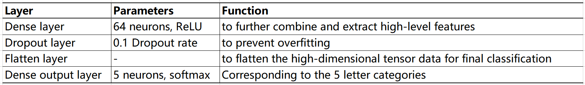
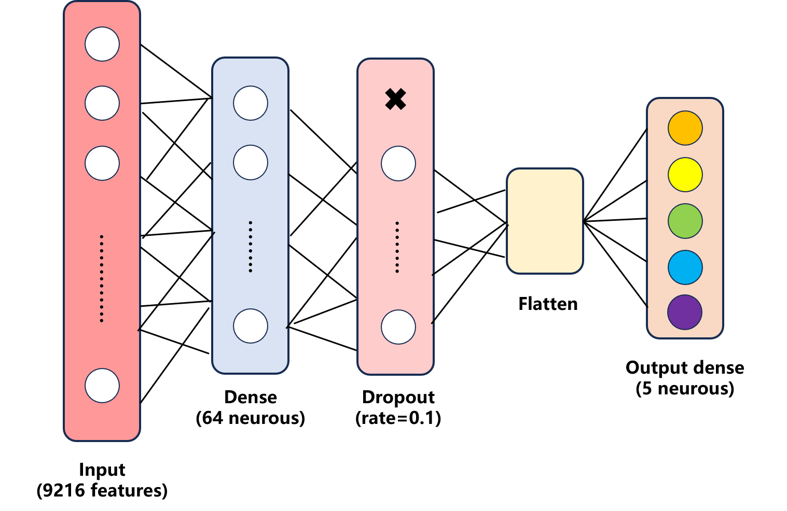
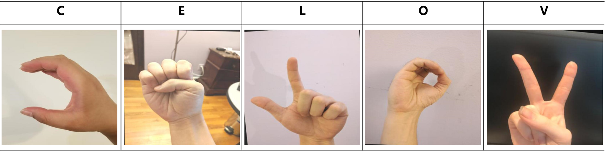
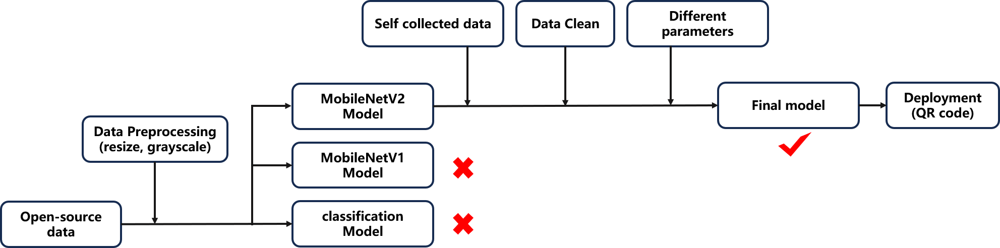
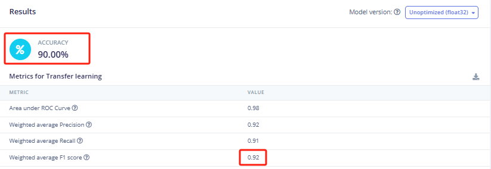
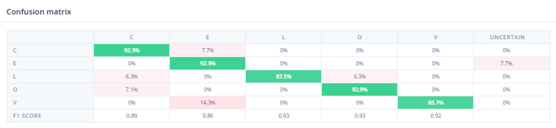

# Final Project
Since the project is deployed by scanning the QR code on the edge impluse directly with a mobile phone, please see the detailed project information:
edge impluse link: https://studio.edgeimpulse.com/studio/679174

The final model architecture chosen for this project is on a MobileNetV2 backbone (alpha=0.35), with a custom classification head comprising:

  
  
Fig.1 Layers

  
  
Fig.2 Model architecture

### Research Question
Is it feasible to develop a deep learning-based sign language recognition model for mobile devices to enable real-time communication?

## Data
This project combines open-source datasets with self-collected samples. The open-source data comes from the SIBI_sign_language2 dataset (2024) on the Roboflow Universe platform, focusing on five specific classes: "C," "E," "L," "O," and "V," comprising a total of 334 images (Fig.3).The self-collected data consists of 52 real-world samples captured by 8 volunteers under different indoor and outdoor lighting conditions using smartphones. 

  
  
Fig.3 Example images

## Application Overview
This project includes the following implementation stages (Fig.4):   
•	Data Collection and Processing: Initial testing is conducted using open-source datasets, and real-world samples are collected through the smartphone for data augmentation. The data preprocessing module on the Edge Impulse platform is used to quickly extract features, laying the foundation for model training.  
•	Model Selection and Optimization: The control variable method is employed to systematically test different model architectures and hyperparameter combinations. Training performance and generalization capability are evaluated iteratively to progressively optimize the model.   
•	Deployment and Application: The final model is deployed to a smartphone by scanning the QR code generated by the Edge Impulse, enabling real-time image acquisition and sign language recognition. 

  
  
Fig.4 Application_digram

### Documentation of experiments and results 
The final deployed model achieved a test accuracy of 90.0% and a weighted F1 score of 0.92 (Fig.5), demonstrating strong overall classification performance. 

  
  
Fig.5 model testing

For more detailed information, please see the report and experiments on the edge impluse platform.
edge impluse link: https://studio.edgeimpulse.com/studio/679174

### Critical reflection and learning from experiments 
The confusion matrix (Fig.6) shows that each category has a high degree of differentiation, but there are still some misclassifications, particularly for the "V" category, which shares visual features similar to those of gestures like "L," resulting in a relatively higher misclassification rate. Additionally, in the actual testing on the smartphone, the "C" and "O" categories showed significantly higher misjudgment rates due to motion blur during gesture transitions, compared to the ideal scenario.

  
  
Fig.6 The confusion matrix

 

Despite these challenges, the data augmentation and data cleaning strategies significantly improved the model's generalization performance. Additionally, increasing the number of neurons in the Dense layer (to 64 neurons) effectively enhanced the model's feature representation capability, reducing classification errors. Sufficient training epochs (75 epochs) and an appropriate learning rate (0.0005) ensured the model trained stably and converged efficiently. The use of a suitable dropout rate (0.1) helped avoid overfitting.    
If more time and resources are available, I plan to implement the following improvements:  
•	Dataset Expansion: Add more samples under various lighting conditions, backgrounds, and user-specific differences to enhance model robustness.    
•	Hard Sample Mining: Targeted training on samples near the decision boundary to improve classification margins and reduce misclassification.   
•	Temporal Modeling: Explore applying temporal models to video data to capture the dynamic features of gestures over time, mitigating the impact of motion blur and improving the stability and accuracy of the model in real-world applications.  
