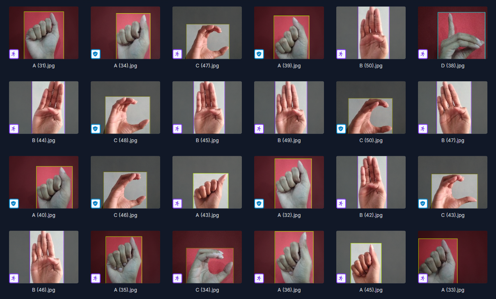

# Real-Time Sign Language Recognition on Smartphones via MobileNetV2 and Edge Impulse

JINMING XIA   
github: https://github.com/JINMING2333/casa0018_coursework 
edge impluse link: https://studio.edgeimpulse.com/studio/679174

## Introduction
Sign language is one of the most important ways for deaf people to communicate with the outside world. However, most able-bodied individuals cannot understand sign language (Fig.1), which becomes a barrier for hearing-impaired individuals to integrate into society (Wei Hao et al, 2024 ). Therefore, this project aims to develop a lightweight sign language recognition system based on a smartphone camera, through real-time image recognition and classification, in order to improve the communication convenience between hearing-impaired individuals and able-bodied individuals.

  
  
Fig.1

Sign language recognition technology can be categorized into vision-based and sensor-based methods, depending on the motion capture equipment used. Early research primarily relied on wearable sensors, but in recent years, with the development of deep learning and computer vision, vision-based sign language recognition has gradually become the mainstream solution (Mukhiddin Toshpulatov et al, 2025 ). Although Edge Impulse and the TinyML community have demonstrated that deep learning models can run on microcontrollers such as Arduino Nano, vision-based gesture recognition requires higher computational resources and camera quality. Therefore, smartphones, with their strong computing capabilities, high camera quality, and widespread usage, have become an ideal deployment platform.  
This project successfully deployed a lightweight sign language recognition model on a mobile device, utilizing transfer learning based on MobileNetV2, and achieved high-accuracy recognition of five basic sign language letters.

## Research Question
Is it feasible to develop a deep learning-based sign language recognition model for mobile devices to enable real-time communication?

## Application Overview
This project includes the following implementation stages:   
•	Data Collection and Processing: Initial testing is conducted using open-source datasets, and real-world samples are collected through the smartphone for data augmentation. The data preprocessing module on the Edge Impulse platform is used to quickly extract features, laying the foundation for model training.  
•	Model Selection and Optimization: The control variable method is employed to systematically test different model architectures and hyperparameter combinations. Training performance and generalization capability are evaluated iteratively to progressively optimize the model.   
•	Deployment and Application: The final model is deployed to a smartphone by scanning the QR code generated by the Edge Impulse, enabling real-time image acquisition and sign language recognition. 

## Data
This project combines open-source datasets with self-collected samples. The open-source data comes from the SIBI_sign_language2 dataset (2024) on the Roboflow Universe platform, focusing on five specific classes: "C," "E," "L," "O," and "V," comprising a total of 334 images. After importing the data into the Edge Impulse, these images are automatically divided into training and testing sets in an approximately 81% to 19% ratio, ensuring the independence of model training and performance evaluation.  
The self-collected data consists of 52 real-world samples captured by 8 volunteers under different indoor and outdoor lighting conditions using smartphones. This dataset aims to enhance the model’s generalization ability in real-world environments.
Before model training, all data should be preprocessed using the Input Block and Processing Block of the Edge Impulse. Since the data type is images, the Image mode is selected in the Input Block to uniformly rescale and normalize pixel values, standardizing all image sizes to 96×96 pixels. 
Next, I used the Processing Block (DSP Block) for further feature extraction. This block normalizes the image depth and retains spatial features, transforming raw images into feature tensors that are efficient for the model to learn. I built a Baseline Model, keeping other settings unchanged. Through a comparison experiment between RGB and Grayscale color depths, I found that Grayscale significantly improved model performance. Therefore, this project ultimately selected Grayscale as the standard data preprocessing scheme.

## Model
The final model architecture chosen for this project is on a MobileNetV2 backbone (alpha=0.35), with a custom classification head comprising:   
To validate the effectiveness of this architecture, multiple structures were systematically compared within the Learning Block, including shallow classification models (classification) and transfer learning models (MobileNetV1 and MobileNetV2).
The shallow classification models are simple, with low computational overhead, making them suitable for quick experimentation. However, in preliminary testing using 334 open-source images, the classification model achieved 69.7% accuracy on the training set, but performed poorly on the validation (46.3%) and test sets (3.1%), clearly unable to generalize. Even with increased training epochs and adjustments to the number of neurons in the Dense layer, the performance did not significantly improve, and overfitting occurred, indicating that shallow models have very limited generalization ability on small datasets.    
In contrast, the transfer learning model is based on pre-trained models and supports data augmentation, making it more suitable for small-sample training. Experimental comparisons showed that MobileNetV2 consistently outperforms MobileNetV1 in both generalization and classification accuracy. Even after manually supplementing MobileNetV1 with a final Dense layer (to match the MobileNetV2 structure) in Expert Mode, its performance remained inferior. Therefore, I can definitively exclude MobileNetV1 and confirm that MobileNetV2 is a better choice for subsequent optimization and deployment. 

## Experiments
After selecting MobileNetV2, I further explored the impact of different alpha values (0.1 and 0.35) on model performance. Alpha is a parameter in MobileNet that controls the network width. The smaller the value, the lighter the model and the faster the inference speed, but it is typically accompanied by a decrease in accuracy. While initial performances of alpha=0.1 and alpha=0.35 were similar, extended training to 50 epochs revealed that the alpha=0.35 model consistently outperformed the alpha=0.1 model in both generalization and accuracy, with only a minor increase in resource consumption. Therefore, MobileNetV2 with alpha=0.35 was selected for further optimization. 

Next, to bridge the gap between the laboratory data and real-world data, we incorporated part of the self-collected data into the training set, while keeping the remaining data in the test set, balancing model training with generalization performance evaluation. After manually filtering and removing ambiguous samples, the accuracy of the test set improved from 73.3% to 77.1%, and the F1 score increased from 0.79 to 0.83. Although the training loss slightly increased, the overall generalization performance and the clarity of the decision boundary were significantly enhanced, validating the effectiveness of the data cleaning strategy.

Additionally, due to the slight oscillation in validation loss during late training stages indicated minor overfitting. To mitigate this, different Dropout rates (0.1, 0.2, 0.3) were evaluated. Dropout is a commonly used regularization method that prevents the model from over-relying on specific feature combinations by randomly "dropping out" some neurons in the neural network, thus improving generalization ability. The results showed that a Dropout rate of 0.1 performed the best (77.1% test accuracy, 0.83 F1-score), while higher Dropout rates actually reduced the model’s performance. This could be because excessive neuron deactivation limited the model’s expressive power.

So, I tried increasing the number of neurons in the Dense layer (8, 16, 32, 64, 128) to enhance the model's expressive capability. The experimental results indicated that a Dense layer with 32 neurons achieved the highest accuracy, while 64 neurons showed better performance in terms of loss and generalization stability.

By further tuning different epoch numbers (50, 75) and learning rates (0.0003, 0.0005, 0.001) in an attempt to further converge the model and improve stability, the results showed that with Dense=32, longer training periods led to an increase in loss (e.g., loss rising to 1.21). However, with Dense=64, increasing the training epochs to 75 effectively reduced the loss and improved both validation and test performance. In terms of learning rates, 0.0003 was stable but with slightly lower accuracy, while 0.001 converged quickly but showed significant fluctuations. Considering all factors, the learning rate of 0.0005 was chosen as the best balance. 
     
In summary, the combination of MobileNetV2 (alpha=0.35), Dropout rate of 0.1, 64 neurons in the Dense layer, 75 epochs, and a learning rate of 0.0005 achieved the best overall performance. The final model achieved 100% training accuracy, with the validation accuracy remaining stable between 81% and 87%, and the validation loss stabilized between 0.45 and 0.55, demonstrating excellent generalization performance, making it suitable for real-world deployment.

## Results and Observations
The final deployed model achieved a test accuracy of 90.0% and a weighted F1 score of 0.92, demonstrating strong overall classification performance. The confusion matrix shows that each category has a high degree of differentiation, but there are still some misclassifications, particularly for the "V" category, which shares visual features similar to those of gestures like "L," resulting in a relatively higher misclassification rate. Additionally, in the actual testing on the smartphone, the "C" and "O" categories showed significantly higher misjudgment rates due to motion blur during gesture transitions, compared to the ideal scenario.    
Despite these challenges, the data augmentation and data cleaning strategies significantly improved the model's generalization performance. Additionally, increasing the number of neurons in the Dense layer (to 64 neurons) effectively enhanced the model's feature representation capability, reducing classification errors. Sufficient training epochs (75 epochs) and an appropriate learning rate (0.0005) ensured the model trained stably and converged efficiently. The use of a suitable dropout rate (0.1) helped avoid overfitting.    
If more time and resources are available, I plan to implement the following improvements:  
•	Dataset Expansion: Add more samples under various lighting conditions, backgrounds, and user-specific differences to enhance model robustness.    
•	Hard Sample Mining: Targeted training on samples near the decision boundary to improve classification margins and reduce misclassification.   
•	Temporal Modeling: Explore applying temporal models to video data to capture the dynamic features of gestures over time, mitigating the impact of motion blur and improving the stability and accuracy of the model in real-world applications.  

## Bibliography

1. Last name, First initial. (Year published). Title. Edition. (Only include the edition if it is not the first edition) City published: Publisher, Page(s). http://google.com

2. Last name, First initial. (Year published). Title. Edition. (Only include the edition if it is not the first edition) City published: Publisher, Page(s). http://google.com

*Tip: we use [https://www.citethisforme.com](https://www.citethisforme.com) to make this task even easier.* 

----

## Declaration of Authorship

I, AUTHORS NAME HERE, confirm that the work presented in this assessment is my own. Where information has been derived from other sources, I confirm that this has been indicated in the work.

JINMING XIA

ASSESSMENT DATE 29/04/2025

Word count:1549 
